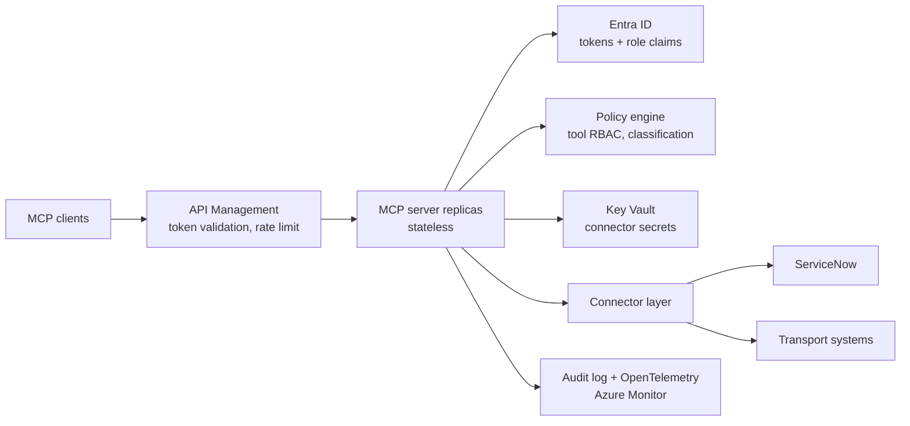

# Governed MCP Server

A reference implementation of the layers an enterprise has to add around a
Model Context Protocol (MCP) server before it can carry production traffic:
identity, tool-level authorization, connector isolation, audit, and
observability.

The protocol part of MCP is the easy part. What decides whether an MCP layer
can be handed over to an internal platform team is everything wrapped around
it — who may call which tool, against which system, with what recorded
afterwards. This repository builds that out in tranches, on top of a stateless
`2026-07-28` server.

**Status: tranche 1 — identity and authorization, implemented and tested.**
Token verification and declarative per-tool access control run and are covered
by 31 tests, in-memory and over real HTTP. Tranches 2–6 under
[Roadmap](#roadmap) are designed but not yet implemented, and are marked as
such. Nothing here has been deployed against a live Azure tenant — the
authorization path is exercised against a local identity provider that mints
Entra-shaped tokens (see [Authorization](#authorization)).

## Why stateless first

No `initialize` handshake, no `Mcp-Session-Id`. Every request carries its own
protocol version and capabilities, so **any replica can answer any request** —
this goes behind a plain round-robin load balancer with zero sticky-session
configuration, which was the main operational pain point with MCP servers
before this spec.

That is not only an operational convenience. It removes session affinity as a
constraint on how the layer is deployed, which is what makes the rest of the
roadmap tractable: authorization, rate limiting and audit are all simpler to
reason about when there is no per-session server state to keep consistent
across instances.

## Target architecture



Real today: the stateless server replicas, their transport, token verification
against the identity provider, and the policy engine. Key Vault, the connector
layer, API Management and the Azure Monitor export are target state.

## Setup

```bash
python3 -m venv venv
source venv/bin/activate        # venv\Scripts\activate on Windows
pip install -r requirements.txt

pip install -r requirements-dev.txt   # to run the tests
python -m pytest -q
```

## Files

- **`server.py`** — the MCP server. Two tools (`get_shipment_status`,
  `list_delayed_shipments`) and one resource template (`shipment://{id}`),
  built with `MCPServer` (the v2 rename of `FastMCP` — same decorator API
  you'd already recognize). `create_server(auth_mode=...)` selects the
  authorization posture.
- **`policy.yaml`** — who may call what. The whole access-control model, as a
  reviewable document.
- **`governance/`** — the layers wrapped around the server:
  - `verifier.py` — Entra ID token validation, implementing the SDK's
    `TokenVerifier` protocol
  - `policy.py` — the policy document and the decisions it yields
  - `middleware.py` — enforcement, applied uniformly to every request
  - `audit.py` — the authorization decision trail
  - `devidp.py` — a local identity provider, so all of the above is testable
    with no Azure tenant
- **`client.py`** — exercises the server along two independent axes,
  transport and protocol era:
  - `python client.py` — in-memory, no transport at all (fastest way to test)
  - `python client.py --http` — talks to a running `server.py` over
    Streamable HTTP, same as a real client would
  - add `--legacy` to either one to negotiate as a pre-2026 client (see
    "Old clients" below)

The tools are backed by an **in-memory fixture, not a real system**. They are
shaped like the transport and logistics domain deliberately, so the
authorization and connector layers have something realistic to wrap — but they
are placeholders, and tranche 2 replaces them.

## Run it

Terminal 1:
```bash
python server.py
# Uvicorn running on http://127.0.0.1:8000/mcp
```

Terminal 2:
```bash
python client.py --http
```

Expected output:
```
tools: ['get_shipment_status', 'list_delayed_shipments']
get_shipment_status(SHP-1002) -> {'id': 'SHP-1002', 'status': 'delayed', ...}
list_delayed_shipments(24) -> [{'id': 'SHP-1002', ...}, {'id': 'SHP-1004', ...}]
shipment detail -> SHP-1004: Zeebrugge -> Koln, status delayed, ...
protocol version negotiated: 2026-07-28
```

## Authorization

Three postures, selected with `--auth`:

| Mode | Tokens | Use |
| --- | --- | --- |
| `off` (default) | none required | the transport demo above |
| `dev` | in-process identity provider | development and the test suite |
| `entra` | a real Entra tenant | configured via environment variables |

`dev` and `entra` differ **only in where signing keys are fetched from** — a
static JWKS versus the tenant's JWKS endpoint. The verifier, the policy and the
enforcement path are identical, so the tests exercise the code that runs in
production, and moving to a tenant is configuration rather than a rewrite.

### Try it

```bash
python server.py --auth dev --port 8000 &

# Mint tokens. The signing key is persisted to .devidp-key.pem so a second
# process signs with the key the running server verifies against.
READER=$(python server.py --auth dev --print-token tlo.reader)
NOROLE=$(python server.py --auth dev --print-token)
```

No token — a challenge pointing at the metadata document, per RFC 9728:

```
$ curl -i -X POST localhost:8000/mcp -d '{"jsonrpc":"2.0","id":1,"method":"tools/list"}'
HTTP/1.1 401 Unauthorized
www-authenticate: Bearer error="invalid_token", error_description="Authentication
  required", resource_metadata="http://127.0.0.1:8000/.well-known/oauth-protected-resource/mcp"
```

With `$READER`, the call succeeds. With `$NOROLE` the token is *valid* — it
just carries no role that grants the tool:

```
tools visible: []                       # discovery is filtered to the caller
MCPError -32003 Access denied for 'get_shipment_status': caller holds none of
                the roles this tool requires
```

### What is actually enforced

**Token validation** (`governance/verifier.py`). Signature against the issuer's
published keys, then three checks that decide whether this is a real gate or
decoration:

- **Audience, exactly.** The token must name *this* server. This is the
  confused-deputy defence: a token a user legitimately holds for another
  service must not be replayable here, and a token this server receives must
  not be forwardable upstream. It is the most commonly skipped check in MCP
  deployments, and the reason token passthrough is called out as an
  anti-pattern in the specification.
- **Asymmetric algorithms only.** Permitting an HMAC algorithm lets a caller
  sign their own tokens using the *public* key as the shared secret — the
  algorithm-confusion attack. `alg: none` is rejected for the same reason. The
  constructor refuses an unsafe algorithm rather than trusting the caller to
  pass a safe list.
- **Expiry, issuer, and required claims**, with a small clock-skew allowance.

**Per-tool access control** (`policy.yaml`, `governance/policy.py`). Entra app
roles arrive in the token's `roles` claim and are matched against a declarative
document — data, not code, so it can be reviewed by people who do not read
Python, diffed in a change request, and pointed at during an audit. Two
properties are deliberate:

- **Fail closed.** A tool with no policy entry is denied. Shipping a tool
  without an authorization decision makes it unreachable, which is a visible
  bug, rather than public, which is a silent one.
- **Fail fast.** Every role a rule references must be declared. A typo in a
  role name stops the server from starting, instead of producing a rule that
  can never match — and a rule that never matches is invisible in testing and
  looks exactly like a working deny.

**Enforcement** (`governance/middleware.py`) is server middleware, so it sees
every request before dispatch and applies to every tool uniformly. There is no
per-tool decorator for an author to forget. Denials are raised before the
handler runs, so an unauthorized call never reaches a downstream system.
`tools/list` is filtered to what the caller may actually invoke — listing a
tool someone cannot call leaks the shape of systems they have no access to,
and invites an agent to plan around a call that will always be refused.

**Two tiers, one decision point.** Scopes gate whether a caller may reach the
server at all, at the transport layer. Roles gate which tools they may then
invoke, in the policy. Authorization decisions live in exactly one place, which
is what makes "why was this allowed" answerable.

**Audit** (`governance/audit.py`) records every decision as a JSON line —
principal, target, outcome, reason, classification, roles required and held.
It is deliberately a separate stream from application logging, with its own
handler and no propagation to the root logger: they have different readers,
retention and access rules, and the SDK's `rich` handler wraps long lines,
which silently corrupts anything meant to be parsed later.

```json
{"timestamp":"2026-07-31T19:58:22Z","principal":"user@example.com","method":"tools/call",
 "target":"get_shipment_status","outcome":"deny","reason":"caller holds none of the roles
 this tool requires","classification":"internal","required_roles":["tlo.operator",
 "tlo.reader"],"granted_roles":[],"argument_names":["shipment_id"]}
```

Argument *values* are not recorded. Shipment identifiers are low risk, but the
same path will carry incident bodies and customer references once the
connectors land, and a log that quietly became confidential-tier is worse than
one that never held the data.

**Shadow mode.** `--shadow` audits decisions without enforcing them, so a
policy can be trialled against real traffic and the calls it would break found
before it starts breaking them.

### Against a real tenant

```bash
export MCP_ENTRA_TENANT_ID=<tenant-guid>
export MCP_RESOURCE_AUDIENCE=api://governed-mcp-server   # the app registration's ID URI
python server.py --auth entra
```

Roles come from app roles defined on that app registration and assigned to
users or service principals. Signing keys are fetched from the tenant's JWKS
endpoint and cached by key id, so key rollover needs no restart. This path is
implemented but has not been run against a live tenant.

## Old clients

The claim that one endpoint serves both eras is worth verifying rather than
taking on faith, so `--legacy` makes the client negotiate the way a pre-2026
client does:

```bash
python client.py --http --legacy
# ...
# protocol version negotiated: 2025-11-25
```

Same server, same URL, no server-side flag — only the client's negotiation
policy changed. What's actually different:

- **Default (`mode="auto"`)** — the client probes `server/discover` at
  `2026-07-28`. Anything that isn't positive evidence of a modern server (a
  JSON-RPC error, an HTTP 4xx, an unparseable result, or a discover result
  advertising only handshake-era versions) falls back to `initialize`. The
  fallback is a denylist, so an unknown legacy server degrades rather than
  failing.
- **`--legacy` (`mode="legacy"`)** — skips the probe entirely and sends
  `initialize`, byte-identical to pre-2026 behavior. In-memory this also
  drives the real stream loop instead of the direct per-request path, so it
  exercises the old code path rather than just relabeling the version.

The negotiated version picks how every later request is stamped: `2026-07-28`
puts protocol version, client info and capabilities into each request's
`_meta`, which is what makes any replica able to answer it. `2025-11-25` sends
only the `Mcp-Protocol-Version` header, because the rest lives in the session
that `initialize` set up.

One limitation: you can't pin an arbitrary old version. `mode=` takes
`"auto"`, `"legacy"`, or a modern version string — passing `"2025-11-25"`
raises `ValueError` and tells you to use `mode="legacy"`. The handshake-era
version is the server's pick (newest both sides know, so `2025-11-25` here).
Simulating a genuinely older client (`2025-06-18`, `2024-11-05`) means
dropping to `ClientSession` and building the `InitializeRequest` yourself —
the server honors it, the `Client` wrapper won't emit it.

A platform rarely controls all of its clients, so single-endpoint backwards
compatibility is a requirement rather than a nicety — and it is one fewer
migration to coordinate during onboarding.

## Proving statelessness to yourself

Run `server.py` on two ports, then alternate requests between them and confirm
every one succeeds regardless of which instance answers:

```bash
python server.py --port 8000 &
python server.py --port 8001 &

for p in 8000 8001 8000 8001; do
  python client.py --http --url http://127.0.0.1:$p/mcp | tail -1
done
```

There's no shared session store to wire up, which is the whole point of the
release. Put a real load balancer in front instead of the loop and nothing
about the server changes.

Note: `MCPServer("name", port=...)` is no longer valid in v2 — port
configuration moved onto `uvicorn.run(..., port=...)`, which is what the
`--port` flag above drives.

## Roadmap

Ordered by how much each tranche says about running MCP in an enterprise,
rather than by implementation order.

1. ~~**Identity and authorization.**~~ **Done** — see
   [Authorization](#authorization). Protected-resource metadata,
   `WWW-Authenticate` challenge, JWKS validation through a custom
   `TokenVerifier`, strict audience validation, and declarative per-tool RBAC
   with an audit record per decision.
   Still outstanding here: the SDK exposes `identity_assertion_enabled`
   (SEP-990 ID-JAG, the RFC 7523 jwt-bearer grant) for enterprise identity
   provider flows, which is the right primitive for on-behalf-of chains and is
   not yet wired up.
2. **Connector architecture.** A connector base with declarative manifests —
   authentication mode, Key Vault secret reference, rate limit, retry and
   circuit breaker, data classification — with tools generated from manifests
   rather than hand-decorated. Record/replay mock mode so the repository runs
   with no credentials.
3. **ServiceNow domain and a lighthouse use case.** Table API connector
   (incident search, create, state update, CMDB lookup) against a free
   Personal Developer Instance. Then one end-to-end flow: shipment delay →
   correlate to configuration item → enrich or open an incident, with the
   human approval gate built on the `2026-07-28` input-needed/resume pattern.
   That pattern replaces the old elicitation callback: rather than the server
   calling back to the client mid-request, it returns an "input needed" result
   with a token and the client calls the tool again with the answer attached.
4. **Audit and observability.** OpenTelemetry tracing is on by default in this
   SDK and no-op until an exporter is attached; attach one. Spans carrying
   principal, tool, connector, classification, policy decision, latency and
   cost — plus a **separate append-only audit log**, redacted by
   classification. Audit and telemetry are different deliverables with
   different retention and access rules, and collapsing them into one stream
   is a mistake. Dashboards and alert rules committed as artefacts.
5. **Deployment.** Bicep for Container Apps, API Management, Entra app
   registrations, Key Vault, Log Analytics and private endpoints. The API
   Management policy — token validation, per-subject rate limiting, logging —
   matters more here than the compute configuration.
6. **Operational documentation.** Architecture decision records, a security
   baseline with data classification tiers and a STRIDE threat model covering
   MCP-specific threats (tool poisoning, rug-pull, injection via tool results,
   confused deputy), runbooks for secret rotation and connector revocation,
   and a guide for onboarding the second domain.

## License

Apache License 2.0 — see [LICENSE](LICENSE) and [NOTICE](NOTICE). Apache
rather than MIT for the explicit patent grant, since this is meant to be
readable and reusable inside an enterprise.

## Notes on the SDK

`mcp[cli]==2.0.0rc1` is pinned exactly — the v2 line isn't stable yet, so pin
exact versions and expect to bump this. Anything depending on `mcp` in
production should add an upper bound like `mcp>=1.27,<2` so the eventual
stable v2 doesn't surprise you.
