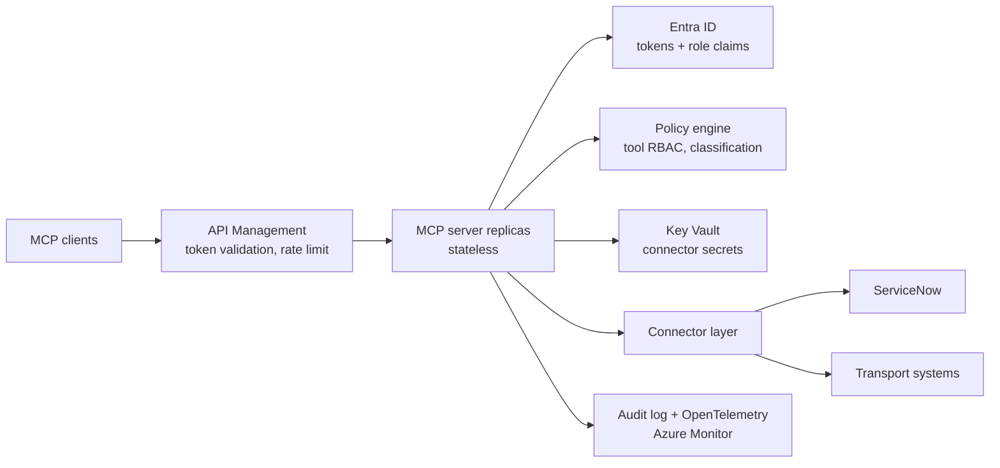

# Governed MCP Server

A reference implementation of the layers an enterprise has to add around a
Model Context Protocol (MCP) server before it can carry production traffic:
identity, tool-level authorization, connector isolation, audit, and
observability.

The protocol part of MCP is the easy part. What decides whether an MCP layer
can be handed over to an internal platform team is everything wrapped around
it — who may call which tool, against which system, with what recorded
afterwards. This repository builds that out in tranches, on top of a stateless
`2026-07-28` server.

**Status: tranches 1, 3, 6 and 7 implemented** — identity and authorization, the
ServiceNow domain with its lighthouse use case, the operational documentation in
[`docs/`](docs/), and the service level framework. 89 tests, in-memory and over
real HTTP. Tranches 2, 4 and 5 under [Roadmap](#roadmap) are designed but not
yet implemented, and are marked as such.

Nothing here has been deployed against a live Azure tenant, and the ServiceNow
connector runs against an in-process mock by default — so the repository has no
credentials in it and needs none to run.

## Why stateless first

No `initialize` handshake, no `Mcp-Session-Id`. Every request carries its own
protocol version and capabilities, so **any replica can answer any request** —
this goes behind a plain round-robin load balancer with zero sticky-session
configuration, which was the main operational pain point with MCP servers
before this spec.

That is not only an operational convenience. It removes session affinity as a
constraint on how the layer is deployed, which is what makes the rest of the
roadmap tractable: authorization, rate limiting and audit are all simpler to
reason about when there is no per-session server state to keep consistent
across instances.

## Target architecture



Real today: the stateless server replicas, their transport, token verification
against the identity provider, and the policy engine. Key Vault, the connector
layer, API Management and the Azure Monitor export are target state.

## Setup

```bash
python3 -m venv venv
source venv/bin/activate        # venv\Scripts\activate on Windows
pip install -r requirements.txt

pip install -r requirements-dev.txt   # to run the tests
python -m pytest -q
```

## Files

- **`server.py`** — the MCP server. Two tools (`get_shipment_status`,
  `list_delayed_shipments`) and one resource template (`shipment://{id}`),
  built with `MCPServer` (the v2 rename of `FastMCP` — same decorator API
  you'd already recognize). `create_server(auth_mode=...)` selects the
  authorization posture.
- **`policy.yaml`** — who may call what, and what needs a human. The whole
  access-control model, as a reviewable document.
- **`sla.yaml`** — what has been promised about it, and the service map. Tiers,
  error budgets, and the dependencies that cap them.
- **`governance/`** — the layers wrapped around the server:
  - `verifier.py` — Entra ID token validation, implementing the SDK's
    `TokenVerifier` protocol
  - `policy.py` — the policy document and the decisions it yields
  - `middleware.py` — enforcement, applied uniformly to every request
  - `approval.py` — the human-in-the-loop gate
  - `request_state.py` — the signing key ring shared across replicas
  - `audit.py` — the authorization decision trail
  - `sla.py` — the service level document, and attainment computed from records
  - `sli.py` — measurement, and the deadline that bounds a latency objective
  - `servicenow.py` — the ITSM connector, live or mocked
  - `devidp.py` — a local identity provider, so all of the above is testable
    with no Azure tenant
- **`client.py`** — exercises the server along two independent axes,
  transport and protocol era:
  - `python client.py` — in-memory, no transport at all (fastest way to test)
  - `python client.py --http` — talks to a running `server.py` over
    Streamable HTTP, same as a real client would
  - add `--legacy` to either one to negotiate as a pre-2026 client (see
    "Old clients" below)

The tools are backed by an **in-memory fixture, not a real system**. They are
shaped like the transport and logistics domain deliberately, so the
authorization and connector layers have something realistic to wrap — but they
are placeholders, and tranche 2 replaces them.

## Run it

Terminal 1:
```bash
python server.py
# Uvicorn running on http://127.0.0.1:8000/mcp
```

Terminal 2:
```bash
python client.py --http
```

Expected output:
```
tools: ['get_shipment_status', 'list_delayed_shipments']
get_shipment_status(SHP-1002) -> {'id': 'SHP-1002', 'status': 'delayed', ...}
list_delayed_shipments(24) -> [{'id': 'SHP-1002', ...}, {'id': 'SHP-1004', ...}]
shipment detail -> SHP-1004: Zeebrugge -> Koln, status delayed, ...
protocol version negotiated: 2026-07-28
```

## Authorization

Three postures, selected with `--auth`:

| Mode | Tokens | Use |
| --- | --- | --- |
| `off` (default) | none required | the transport demo above |
| `dev` | in-process identity provider | development and the test suite |
| `entra` | a real Entra tenant | configured via environment variables |

`dev` and `entra` differ **only in where signing keys are fetched from** — a
static JWKS versus the tenant's JWKS endpoint. The verifier, the policy and the
enforcement path are identical, so the tests exercise the code that runs in
production, and moving to a tenant is configuration rather than a rewrite.

### Try it

```bash
python server.py --auth dev --port 8000 &

# Mint tokens. The signing key is persisted to .devidp-key.pem so a second
# process signs with the key the running server verifies against.
READER=$(python server.py --auth dev --print-token tlo.reader)
NOROLE=$(python server.py --auth dev --print-token)
```

No token — a challenge pointing at the metadata document, per RFC 9728:

```
$ curl -i -X POST localhost:8000/mcp -d '{"jsonrpc":"2.0","id":1,"method":"tools/list"}'
HTTP/1.1 401 Unauthorized
www-authenticate: Bearer error="invalid_token", error_description="Authentication
  required", resource_metadata="http://127.0.0.1:8000/.well-known/oauth-protected-resource/mcp"
```

With `$READER`, the call succeeds. With `$NOROLE` the token is *valid* — it
just carries no role that grants the tool:

```
tools visible: []                       # discovery is filtered to the caller
MCPError -32003 Access denied for 'get_shipment_status': caller holds none of
                the roles this tool requires
```

### What is actually enforced

**Token validation** (`governance/verifier.py`). Signature against the issuer's
published keys, then three checks that decide whether this is a real gate or
decoration:

- **Audience, exactly.** The token must name *this* server. This is the
  confused-deputy defence: a token a user legitimately holds for another
  service must not be replayable here, and a token this server receives must
  not be forwardable upstream. It is the most commonly skipped check in MCP
  deployments, and the reason token passthrough is called out as an
  anti-pattern in the specification.
- **Asymmetric algorithms only.** Permitting an HMAC algorithm lets a caller
  sign their own tokens using the *public* key as the shared secret — the
  algorithm-confusion attack. `alg: none` is rejected for the same reason. The
  constructor refuses an unsafe algorithm rather than trusting the caller to
  pass a safe list.
- **Expiry, issuer, and required claims**, with a small clock-skew allowance.

**Per-tool access control** (`policy.yaml`, `governance/policy.py`). Entra app
roles arrive in the token's `roles` claim and are matched against a declarative
document — data, not code, so it can be reviewed by people who do not read
Python, diffed in a change request, and pointed at during an audit. Two
properties are deliberate:

- **Fail closed.** A tool with no policy entry is denied. Shipping a tool
  without an authorization decision makes it unreachable, which is a visible
  bug, rather than public, which is a silent one.
- **Fail fast.** Every role a rule references must be declared. A typo in a
  role name stops the server from starting, instead of producing a rule that
  can never match — and a rule that never matches is invisible in testing and
  looks exactly like a working deny.

**Enforcement** (`governance/middleware.py`) is server middleware, so it sees
every request before dispatch and applies to every tool uniformly. There is no
per-tool decorator for an author to forget. Denials are raised before the
handler runs, so an unauthorized call never reaches a downstream system.
`tools/list` is filtered to what the caller may actually invoke — listing a
tool someone cannot call leaks the shape of systems they have no access to,
and invites an agent to plan around a call that will always be refused.

**Two tiers, one decision point.** Scopes gate whether a caller may reach the
server at all, at the transport layer. Roles gate which tools they may then
invoke, in the policy. Authorization decisions live in exactly one place, which
is what makes "why was this allowed" answerable.

**Audit** (`governance/audit.py`) records every decision as a JSON line —
principal, target, outcome, reason, classification, roles required and held.
It is deliberately a separate stream from application logging, with its own
handler and no propagation to the root logger: they have different readers,
retention and access rules, and the SDK's `rich` handler wraps long lines,
which silently corrupts anything meant to be parsed later.

```json
{"timestamp":"2026-07-31T19:58:22Z","principal":"user@example.com","method":"tools/call",
 "target":"get_shipment_status","outcome":"deny","reason":"caller holds none of the roles
 this tool requires","classification":"internal","required_roles":["tlo.operator",
 "tlo.reader"],"granted_roles":[],"argument_names":["shipment_id"]}
```

Argument *values* are not recorded. Shipment identifiers are low risk, but the
same path will carry incident bodies and customer references once the
connectors land, and a log that quietly became confidential-tier is worse than
one that never held the data.

**Shadow mode.** `--shadow` audits decisions without enforcing them, so a
policy can be trialled against real traffic and the calls it would break found
before it starts breaking them.

## The lighthouse use case

Transport and Logistics Operations, split into a read half and a write half
because they warrant different privileges:

| Tool | Roles | Classification | Human approval |
| --- | --- | --- | --- |
| `assess_shipment_delay` | reader, operator, admin | internal | no |
| `search_incidents`, `get_configuration_item` | reader, operator, admin | internal | no |
| `raise_shipment_incident` | operator, admin | confidential | **yes** |

`assess_shipment_delay` correlates a late shipment to the configuration item
that handles it and to any incident already open against that item, then
recommends an action. It changes nothing. That separation matters in an agent
loop: an assessment that quietly opened tickets would mean an agent could not
look without also touching production.

The whole flow, over HTTP, against the mock ServiceNow:

```
1. reader assess       -> Raise a new incident against CI-TMS-02.
2. reader raise        -> DENIED: caller holds none of the roles this tool requires
3. operator, declined  -> BLOCKED: not approved: a human declined the action
4. operator, approved  -> INC0020001  CI-TMS-02
5. re-assess           -> Enrich INC0020001 rather than opening a duplicate.
```

### The approval gate

`raise_shipment_incident` contains no approval code. The policy marks it
`requires_approval` and the middleware holds the call, so the gate cannot be
forgotten by a tool author — the same argument as for authorization.

Mechanically it is the 2026-07-28 input-needed/resume flow, which replaced the
elicitation callback: the server returns an `InputRequiredResult` carrying the
question, the client puts it to a human, and the call is retried with the
answer and an opaque `request_state` attached.

**The state is client-controlled on the way back in**, so a gate that trusts it
is decorative — approve a low-urgency incident, retry the same state with
`urgency: 1`. The first version of this repository hand-rolled an HMAC-signed
state binding tool, principal, arguments and expiry to close that hole. It was
then deleted, because the SDK's `RequestStateBoundary` already does it, and
does it better: AES-256-GCM with a key-rotation ring, binding the method, the
tool, a digest of the arguments, a salted principal hash, an audience and an
expiry, fail-closed in both directions. Shipping hand-written cryptography
beside a reviewed implementation, for no additional property, is not a trade
worth making. `governance/approval.py` is now thin, and the tests assert
against the real control rather than a local re-implementation of it.

What is still trusted is the client, which relays the human's decision. Nothing
in the protocol lets a server verify a human was really asked. The gate raises
the bar from "an agent can act unilaterally" to "the client must lie about
consent" — a real improvement, and not the same as proof. A control needing the
stronger property belongs in ServiceNow's own approval workflow.

### ServiceNow

Two backends behind one interface. `mock` is the default: an in-process store
answering the same calls with the same shapes, so the repository and its tests
run with no instance and no credentials. `live` addresses a real instance over
the Table API, with credentials read from `SERVICENOW_INSTANCE`,
`SERVICENOW_USER` and `SERVICENOW_PASSWORD` — a Personal Developer Instance is
enough to exercise it.

```bash
python server.py --auth dev --servicenow live
```

The mock is not only a convenience. A connector that runs in-process is one
whose failure modes can be tested — an expired credential, a configuration item
that does not resolve — and those are exactly the paths that never get
exercised against a live instance, because provoking them there is awkward.

Incident records are projected onto a narrow model rather than passed through.
A ServiceNow incident carries well over a hundred columns, many of them free
text; forwarding all of it to a language model is how data reaches somewhere it
was never classified for.

### Running more than one replica

The approval flow spans two round trips, so the state sealing it must be
verifiable by whichever replica answers the retry. The SDK defaults to a
process-local key, which would quietly reintroduce the session affinity this
whole design exists to avoid. Give every replica the same key:

```bash
export MCP_REQUEST_STATE_KEYS=$(python server.py --print-state-key)
```

It is a rotation ring — the first key seals, every key unseals — so rotation is
three deployments with no dropped approvals. See
[the runbook](docs/runbooks/rotate-request-state-key.md). Unset, the server
still runs and warns that it is single-replica only.

### Against a real tenant

```bash
export MCP_ENTRA_TENANT_ID=<tenant-guid>
export MCP_RESOURCE_AUDIENCE=api://governed-mcp-server   # the app registration's ID URI
python server.py --auth entra
```

Roles come from app roles defined on that app registration and assigned to
users or service principals. Signing keys are fetched from the tenant's JWKS
endpoint and cached by key id, so key rollover needs no restart. This path is
implemented but has not been run against a live tenant.

## Service levels

`policy.yaml` says who may call what. [`sla.yaml`](sla.yaml) says what has been
promised about it — as a second declarative document, validated at startup, with
measurement in middleware and attainment computed from what it records. The
model is in [`docs/sla-framework.md`](docs/sla-framework.md).

| Service | Tier | Availability | p95 | Depends on |
| --- | --- | --- | --- | --- |
| `transport-visibility` | gold | 99.9% | 500 ms | — |
| `delay-assessment` | silver | 98.5% | 2 s | ServiceNow |
| `incident-raising` | silver | 98.5% | 2 s | ServiceNow |

A tier is a bundle of objectives taken on wholesale, so onboarding a domain in
Phase 2 means picking one rather than negotiating numbers. `sla.yaml` also
carries the service map — owner, business service, and the CMDB configuration
items each service runs on — because a service map that disagrees with the SLA
document is worse than either alone.

### The arithmetic the loader enforces

Availability composes multiplicatively across everything in the request path, so
a service reaching one 99% system cannot itself be better than 99%. The loader
computes that ceiling and **refuses to start if a tier promises more than the
dependencies allow**:

```
startup failed: sla.yaml: service 'delay-assessment' is tier 'gold' (99.9000%),
but its dependencies (entra, servicenow) cap it at 98.9901%. Lower the tier,
remove the dependency from the request path, or renegotiate the dependency.
```

The ITSM services are silver for that reason — arithmetic, not modesty. This is
the check that usually gets skipped, and skipping it produces a commitment that
was impossible on the day it was signed and is discovered a quarter later.

### What counts as a failure

The denominator is the part that gets fudged, so it is in code and tested. Tool
errors and calls cancelled at the deadline spend the error budget. Three things
are excluded: **authorization denials**, because a denial is the control working
and counting it as an outage ends with someone loosening the policy to protect a
dashboard; **pauses for human approval**, because waiting on a person is not the
service being slow; and tools no service has claimed. Exclusions are counted and
reported, never silently dropped.

Measurement is registered *outside* policy enforcement so it observes the calls
policy refuses. Measuring inside the gate would exclude denials by never seeing
them — the same clean number, with no record that anyone was turned away.

### Deadlines

Each tier carries a deadline, and the middleware cancels a call that exceeds it.
An objective with nothing enforcing it is a wish: a call that hangs never
breaches a latency objective, it just never appears in the numbers. Enforcement
is per service and **off for `incident-raising`** — cancelling a write mid-flight
can leave the incident created and the caller told it failed, and a duplicate
incident is worse than a slow one. `--no-deadlines` measures without cancelling,
which is the posture to run first.

### Try it

```bash
python server.py --auth dev --sla-log sla.jsonl &
# ... traffic ...
python server.py --sla-report sla.jsonl
```

```
service               tier       events     avail   target   budget   latency   target  status
delay-assessment      silver          1  100.000%  98.500%       0%     0.1ms   2000ms  too few events (need 67)
incident-raising      silver          0        --  98.500%       --        --   2000ms  no data
transport-visibility  gold           10   90.000%  99.900%    >999%     1.2ms    500ms  too few events (need 1000)

1 event(s) excluded from these figures — authorization denials, approval pauses
and unmapped tools.
```

That output is from the demo above, and it is showing the right thing: **a
99.9% objective permits one failure per thousand requests, so ten requests
cannot evaluate it.** A framework that cried breach on ten events would teach
everyone to ignore it before it had enough data to be right. Objectives are
applied at report time rather than baked into the records, so a proposed tier
can also be replayed against history.

The sink is a log file, so there is no alerting and no burn-rate window — that
arrives with tranche 4, at which point these records become metrics and nothing
about the model changes. What happens when a budget is spent is the
[runbook](docs/runbooks/error-budget-exhausted.md).

## Old clients

The claim that one endpoint serves both eras is worth verifying rather than
taking on faith, so `--legacy` makes the client negotiate the way a pre-2026
client does:

```bash
python client.py --http --legacy
# ...
# protocol version negotiated: 2025-11-25
```

Same server, same URL, no server-side flag — only the client's negotiation
policy changed. What's actually different:

- **Default (`mode="auto"`)** — the client probes `server/discover` at
  `2026-07-28`. Anything that isn't positive evidence of a modern server (a
  JSON-RPC error, an HTTP 4xx, an unparseable result, or a discover result
  advertising only handshake-era versions) falls back to `initialize`. The
  fallback is a denylist, so an unknown legacy server degrades rather than
  failing.
- **`--legacy` (`mode="legacy"`)** — skips the probe entirely and sends
  `initialize`, byte-identical to pre-2026 behavior. In-memory this also
  drives the real stream loop instead of the direct per-request path, so it
  exercises the old code path rather than just relabeling the version.

The negotiated version picks how every later request is stamped: `2026-07-28`
puts protocol version, client info and capabilities into each request's
`_meta`, which is what makes any replica able to answer it. `2025-11-25` sends
only the `Mcp-Protocol-Version` header, because the rest lives in the session
that `initialize` set up.

One limitation: you can't pin an arbitrary old version. `mode=` takes
`"auto"`, `"legacy"`, or a modern version string — passing `"2025-11-25"`
raises `ValueError` and tells you to use `mode="legacy"`. The handshake-era
version is the server's pick (newest both sides know, so `2025-11-25` here).
Simulating a genuinely older client (`2025-06-18`, `2024-11-05`) means
dropping to `ClientSession` and building the `InitializeRequest` yourself —
the server honors it, the `Client` wrapper won't emit it.

A platform rarely controls all of its clients, so single-endpoint backwards
compatibility is a requirement rather than a nicety — and it is one fewer
migration to coordinate during onboarding.

## Proving statelessness to yourself

Run `server.py` on two ports, then alternate requests between them and confirm
every one succeeds regardless of which instance answers:

```bash
python server.py --port 8000 &
python server.py --port 8001 &

for p in 8000 8001 8000 8001; do
  python client.py --http --url http://127.0.0.1:$p/mcp | tail -1
done
```

There's no shared session store to wire up, which is the whole point of the
release. Put a real load balancer in front instead of the loop and nothing
about the server changes.

Note: `MCPServer("name", port=...)` is no longer valid in v2 — port
configuration moved onto `uvicorn.run(..., port=...)`, which is what the
`--port` flag above drives.

## Roadmap

Ordered by how much each tranche says about running MCP in an enterprise,
rather than by implementation order.

1. ~~**Identity and authorization.**~~ **Done** — see
   [Authorization](#authorization). Protected-resource metadata,
   `WWW-Authenticate` challenge, JWKS validation through a custom
   `TokenVerifier`, strict audience validation, and declarative per-tool RBAC
   with an audit record per decision.
   Still outstanding here: the SDK exposes `identity_assertion_enabled`
   (SEP-990 ID-JAG, the RFC 7523 jwt-bearer grant) for enterprise identity
   provider flows, which is the right primitive for on-behalf-of chains and is
   not yet wired up.
2. **Connector architecture.** A connector base with declarative manifests —
   authentication mode, Key Vault secret reference, rate limit, retry and
   circuit breaker, data classification — with tools generated from manifests
   rather than hand-decorated. Record/replay mock mode so the repository runs
   with no credentials.
3. ~~**ServiceNow domain and a lighthouse use case.**~~ **Done** — see
   [The lighthouse use case](#the-lighthouse-use-case). Table API connector,
   the delay-to-incident flow, and a declarative human approval gate on the
   `2026-07-28` input-needed/resume pattern.
   Still outstanding here: incident state transitions and work-note enrichment,
   and a run against a live Personal Developer Instance.
4. **Audit and observability.** OpenTelemetry tracing is on by default in this
   SDK and no-op until an exporter is attached; attach one. Spans carrying
   principal, tool, connector, classification, policy decision, latency and
   cost — plus a **separate append-only audit log**, redacted by
   classification. Audit and telemetry are different deliverables with
   different retention and access rules, and collapsing them into one stream
   is a mistake. Dashboards and alert rules committed as artefacts.
   The service levels from tranche 7 are what those dashboards should show:
   the indicators are already emitted per call, and what is missing is the
   exporter, the burn-rate windows and the alert rules on top of them.
5. **Deployment.** Bicep for Container Apps, API Management, Entra app
   registrations, Key Vault, Log Analytics and private endpoints. The API
   Management policy — token validation, per-subject rate limiting, logging —
   matters more here than the compute configuration.
6. ~~**Operational documentation.**~~ **Done** — see [`docs/`](docs/). A
   [security baseline](docs/security-baseline.md) with classification tiers, a
   STRIDE threat model and the MCP-specific threats outside it; runbooks for
   [key rotation](docs/runbooks/rotate-request-state-key.md) and
   [revoking access](docs/runbooks/revoke-access.md);
   [architecture decision records](docs/adr/); and a
   [guide to onboarding the next domain](docs/onboarding-a-domain.md).
7. ~~**Service levels.**~~ **Done** — see [Service levels](#service-levels) and
   [the framework](docs/sla-framework.md). Tiers, error budgets and the service
   map as a declarative document; the dependency ceiling enforced at startup;
   per-call measurement with denials and approval pauses explicitly excluded;
   tier deadlines; and an attainment report.
   Still outstanding here: the records land in a log file rather than a time
   series, so there are no alerts and no burn-rate windows — that is tranche 4.
   The support response targets are declared but not measured, and the
   ServiceNow availability they all hang off is an assumption rather than a
   contracted number.

## License

Apache License 2.0 — see [LICENSE](LICENSE) and [NOTICE](NOTICE). Apache
rather than MIT for the explicit patent grant, since this is meant to be
readable and reusable inside an enterprise.

## Notes on the SDK

`mcp[cli]==2.0.0rc1` is pinned exactly — the v2 line isn't stable yet, so pin
exact versions and expect to bump this. Anything depending on `mcp` in
production should add an upper bound like `mcp>=1.27,<2` so the eventual
stable v2 doesn't surprise you.
